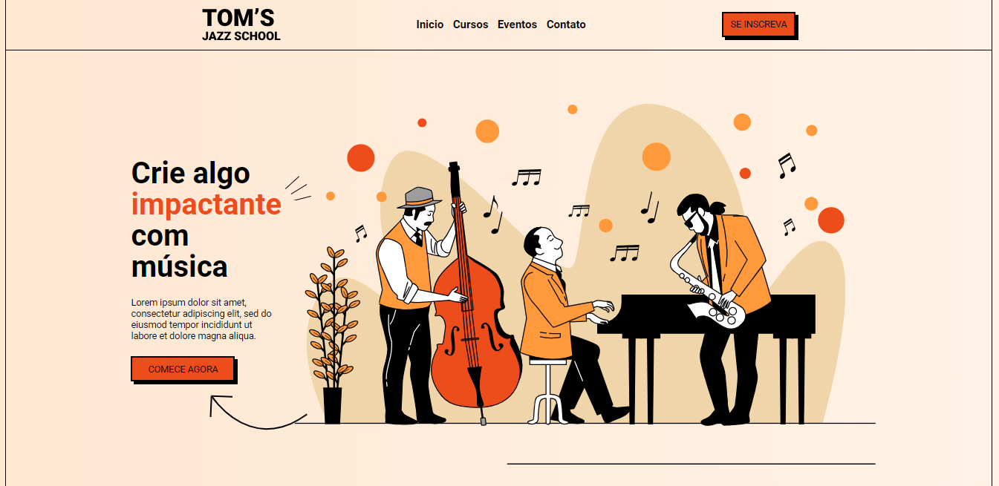
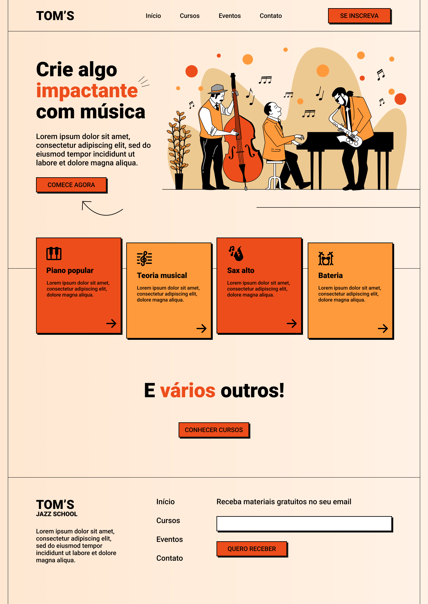
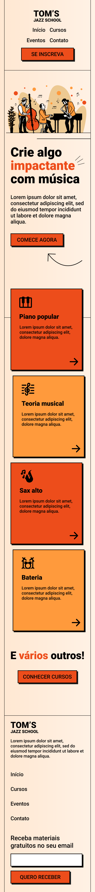

<h1 align="center"> 🎶 Landing Page Escola de Música 🎶 </h1>

Criação de uma landing page de uma escola de música proposto pela <a href="https://pro.onebitcode.com/projetoaulas">Onebitcode</a>

  <a href="#🚀-tecnologias">Tecnologias</a>&nbsp;&nbsp;&nbsp;|&nbsp;&nbsp;&nbsp;
  <a href="#💻-projeto">Projeto</a>&nbsp;&nbsp;&nbsp;|&nbsp;&nbsp;&nbsp;
  <a href="#🔖-layout">Layout</a>&nbsp;&nbsp;&nbsp;

 

  

## 🚀 Tecnologias

Esse projeto foi desenvolvido com as seguintes tecnologias:

- HTML
- CSS
- Git e Github
- Figma

## 💻 Projeto

O projeto _Landing Page_ foi realizado como parte de estudo proposto pela Onebitcode sugerido pelo instrutor <a href="https://github.com/isaacpontes" alt="Link para o GitHub do instrutor Isaac Pontes" target="_blank">Isaac Pontes</a>.

- [Acesse o projeto finalizado, online](https://jp-xaxa.github.io/pagina_esc_jaz/)

<h1 align="center">
  Funcionalidades
</h1>

O desafio foi a criação do layout de uma ladding page seguindo o desing do <a href="#-layout-figma">Layout</a>, além disso, o projeto possui responsividade para mobile.

## 🔖 Layout

Você pode visualizar o layout proposto pela Onebitcode através da <a href="#-layout-figma">imagem abaixo</a>. Disponibilizado pelo [Figma](https://www.figma.com/file/76GJ4uK7PyKeAo6dcpVyjA/Tom's-Jazz-School?type=design&node-id=0-1&mode=design&t=7R1Ce2H3OvQmqrzG-0) durante o período do desafio.

  
   
   
   
  

